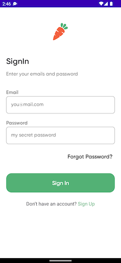

# Buahin
##### _Fruits and vegetables store android app_
This app was originally a project for my final semester exam.

## Features

- Authentication
- Category and product listing
- Add to cart
- Checkout
- Order history
- Favourite
- and more

## Screenshots

## Tech

Dillinger uses a number of open source projects to work properly:

- Jetpack Compose
- Firebase Authentication
- Firebase Cloud Firestore
- Compose Navigation
- Coil
- Kotlin Coroutines
- Compose Safe Routing
- Dagger Hilt
- Lottie
- Toolbar Compose
- Accompanist

## License
MIT
